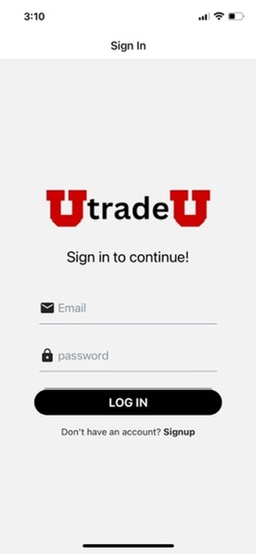

```
Author: Nasser Mughrabi
```

# Overview

UtradeU is a marketplace for University of Utah students and alumni to sell and buy items, aiming to minimize campus waste and promote community engagement.

# Screens

<div>
  
  
  
  
</div>

<div>
  
  
  
</div>

<div>
  
  
  
</div>

# Preview

1. Download EXPO GO app on your phone

<div>
  
</div>

2. Scan QR code for your device (IOS, Android)
<div>
  
  
</div>

# Technologies

1. React Native
2. Firebase
3. AWS S3 Bucket

# Fake Users

1. U1245580@utah.edu, Alba
2. U1448590@utah.edu, Adam
3. U1343549@utah.edu, John
